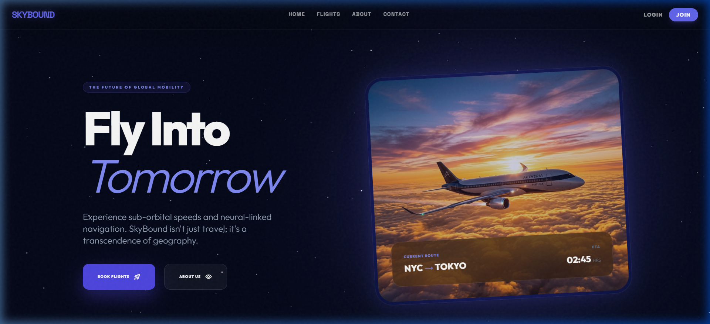
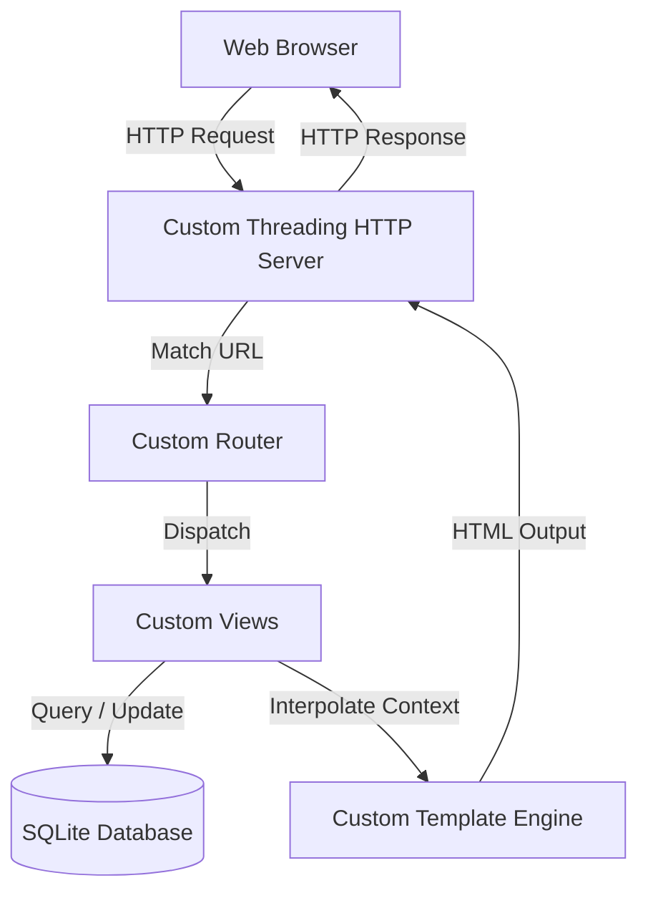

# ✈️ SkyBound — Advanced Flight Management System

[](https://www.python.org/)
[](#-architecture)
[](#-architectural-highlights)
[](#-implemented-design-patterns)

SkyBound is a high-fidelity, premium Flight Management System (FMS). It features a beautiful, responsive user interface styled with modern glassmorphism and runs on a **zero-dependency, custom-built MVC web framework in pure Python**. It also includes a parallel Django setup for framework comparisons.



---

## 🌟 Key Features

### 👤 User Portal
- **Interactive Flight Search:** Real-time filtering for domestic and international flights.
- **Dynamic Seat Selection:** Interactive cabin map with styled seat classes (*Sky Suite*, *Premium*, and *Main Cabin*).
- **Payment Gateway Simulator:** Seamless booking flow with mock payment method strategies.
- **Notification Hub:** Live list of trip confirmations and updates.

### 🛡️ Admin Dashboard
- **Fleet Management:** Add, edit, and monitor active flights.
- **Booking Ledger:** View passenger details, track trip status, and update reservation completions.
- **Passenger Directory:** Complete directory of registered users and system administrators.
- **Message Center:** Direct view of user inquiries submitted via the Contact portal.

---

## 🎨 System Walkthrough



---

## 🚀 Architectural Highlights

SkyBound features a fully functional custom MVC stack built on top of Python's standard `http.server`:
1. **Custom HTTP Server (`server.py`):** A multithreaded `ThreadingHTTPServer` that handles path routing, cookie-based session persistence, request state reconstruction, and static asset mapping.
2. **Regex-Based Router (`core/framework.py`):** Automatically registers routes using a dynamic route table mapping URLs (including path parameters like `/book/<int:id>/`) to views.
3. **Custom Template Engine (`core/framework.py`):** Parses and compiles HTML templates, interpolating python dictionary context, list loops, conditional structures, and object attributes.

---

## 🧩 Implemented Design Patterns

SkyBound showcases clean engineering through several classic **Gang of Four (GoF) Design Patterns**:

### 1. Singleton Pattern
Manages global configuration parameters and settings uniformly across the lifecycle.
* **Location:** [singleton.py](core/singleton.py)
* **Usage:** `AppConfigManager` ensures that configuration details are loaded once and globally shared.

### 2. Strategy Pattern
Encapsulates different payment processing algorithms (Credit Card, EasyPaisa, PayPal) behind a unified interface.
* **Location:** [strategies.py](core/strategies.py)
* **Usage:** `PaymentContext(strategy)` executes specific actions dynamically based on user checkout choices.

### 3. Observer Pattern
Notifies passengers in real time when their flight reservations are successfully booked or updated.
* **Location:** [observers.py](core/observers.py)
* **Usage:** `booking_notifier` registers user observers and issues notifications upon successful database commits.

### 4. Factory Method Pattern
Decouples the instantiation of complex domain entities from client code.
* **Location:** [factories.py](core/factories.py)
* **Usage:** `DomainFactory.create_booking()` and `DomainFactory.create_flight()` standardize how database entities are built.

---

## ⚙️ Quick Start

Because the core implementation relies exclusively on the **Python Standard Library**, you can run the server instantly without installing any external pip packages.

### 1. Run the Custom Python Server
Start the lightweight custom server:
```bash
python server.py
```
Open [http://localhost:8081/](http://localhost:8081/) in your browser. 

*The sqlite3 database (`db.sqlite3`) and demo flights are automatically initialized and seeded on your first visit!*

### 2. Seed Sample Data (Optional)
If you want to manually seed or reset the Django comparison database:
```bash
python seed_data.py
```

### 🗝️ Default Admin Credentials
- **Username:** `Admin`
- **Password:** `admin@123`

---

## 📁 Repository Structure

```text
├── core/
│   ├── custom_views.py  # Views for the custom Python server
│   ├── framework.py     # Custom Router & Template Engine
│   ├── models.py        # Object models for Flights, Bookings, etc.
│   ├── database.py      # SQLite table definitions & connections
│   ├── observers.py     # Observer pattern implementation
│   ├── strategies.py    # Strategy pattern implementation
│   ├── singleton.py     # Singleton pattern implementation
│   ├── factories.py     # Factory pattern implementation
│   ├── templates/       # Pure HTML layouts
│   └── static/          # CSS, JS, and asset files
├── flight_system/       # Standard Django settings and config
├── server.py            # Entry point for the custom server
├── manage.py            # Django management script
├── seed_data.py         # DB seeding script
└── homepage.png         # Screenshot of the user interface
```

---

## 🧪 Testing & Verification

Run unit tests and custom template integration verification:

```bash
# Run Django test suite
python manage.py test

# Run custom template engine & view search test
python test_search.py
```

